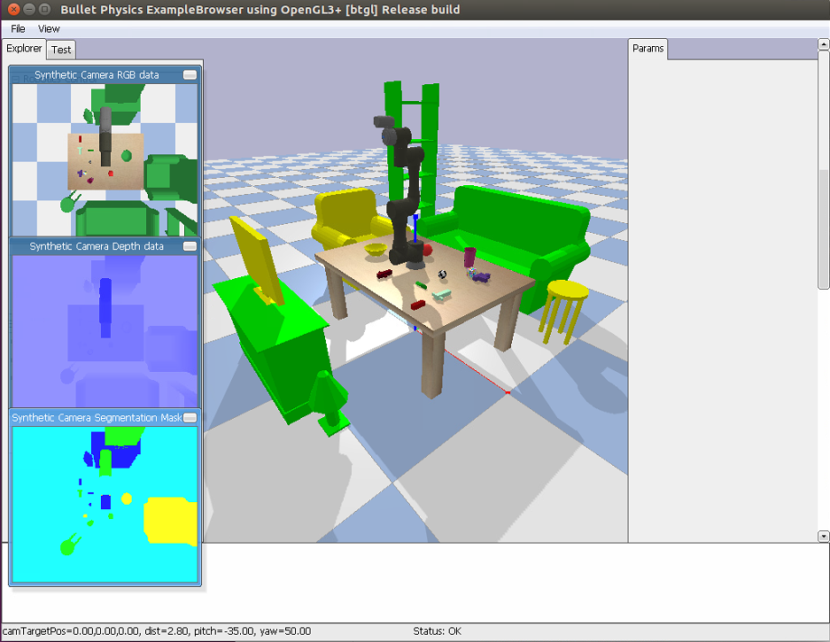

# tm-pybullet
tm robotic arm simulation using pybullet
## Getting Start
* I have created a conda environment for this project.
* Install pybullet (follow the guide [here](https://github.com/bulletphysics/bullet3))
* put "tm_description" in /bullet3/data/
* extract "random_urdfs.zip" to /bullet3/data/
* clone the repository [robocup-code](https://github.com/reem-utils/robocup-code) to /bullet3/data/
* put "tm700Env.py" in /bullet3/examples/pybullet/examples/
* in command line, type `python tm700Env.py`
* the figure below shows the GUI of the simulated environment

<table border=1>
<tr>
<td>

</td>
</tr>
</table>

This figure shows the RGB, depth and segmask of the simulated environment.

## Next 
* Trace the codes for kuka simulation in /bullet3/examples/pybullet/gym/pybullet_envs/baselines/ to learn how to use pybullet for training. 
